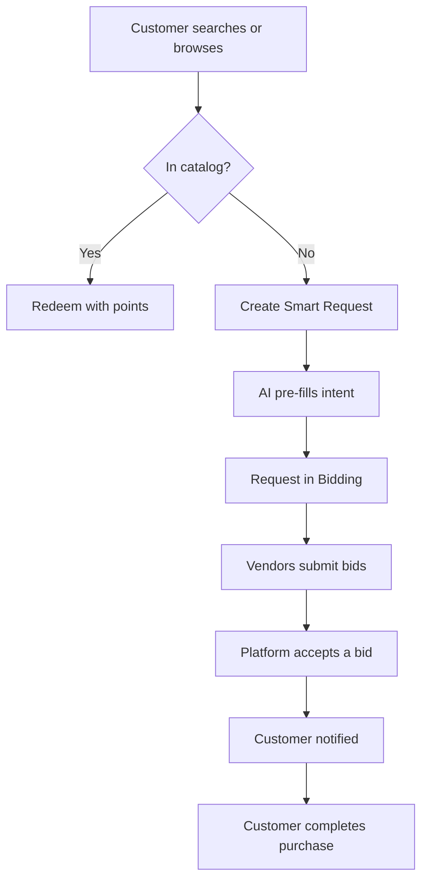

# Reverse Marketplace

A **B2B rewards** prototype: when a user on a rewards platform looks for something specific (often premium) that the fixed catalog doesn’t offer, they can submit a **Smart Request**. The platform pushes that request to a **vendor network** to bid; once a bid is **approved**, the customer is notified to complete the purchase—acting as a **targeted online commerce concierge**.

**[Live prototype (Vercel)](https://v0-smart-request-bulk-buy.vercel.app/)** — Working application built with v0 and deployed on Vercel.

> This repo is not connected to the live deployment above, but it contains the complete setup and latest code of the prototype that was built on v0.

---

## Table of contents

- [What this is](#what-this-is)
- [Product in one sentence](#product-in-one-sentence)
- [Product flow](#product-flow)
- [How it works](#how-it-works)
- [User flows](#user-flows)
- [Business value](#business-value)
- [Catalog vs Smart Request](#catalog-vs-smart-request)
- [Tech stack & build](#tech-stack--build)
- [Future / improvement scope](#future--improvement-scope)

---

## What this is

| | |
| --- | --- |
| **Product name** | Reverse Marketplace |
| **Repo** | [OrangeAKA/reverseMarketplace_](https://github.com/OrangeAKA/reverseMarketplace_) |
| **Live prototype** | [v0-smart-request-bulk-buy.vercel.app](https://v0-smart-request-bulk-buy.vercel.app/) — working app built with v0, deployed on Vercel. |
| **What it is** | A **functional prototype** of a full product in development. This was a **personal prototype** built to **present the business case**. |
| **How it was built** | Prototyped with **v0**, deployed on **Vercel**. Code is on **GitHub** for public visibility—anyone can explore it. This repo is not connected to the live deployment but has the complete setup and latest code of the prototype. |

---

## Product in one sentence

**Reverse Marketplace** is a B2B rewards concept where, on a rewards platform with a **curated (fixed) catalog**, users who want something **specific and often premium** that the catalog doesn’t offer can submit a **Smart Request**; the platform pushes that request to a **vendor network** to **bid**; once a bid is **approved**, the **customer is notified** to complete the purchase—acting as a **targeted online commerce concierge**.

---

## Product flow

The flow below shows how a customer moves from search/browse to purchase—either via the fixed catalog or, when the catalog can’t cater, via Smart Request and vendor bids. When you view this file on GitHub, the diagram renders as an image.

---

## How it works

1. **Customer** browses the fixed rewards catalog or searches for something specific.
2. If the **catalog can’t cater** to the search, the customer can create a **Smart Request** (natural language or structured: what, quantity, budget, required-by). **AI** (Groq/Llama) parses intent and suggests category, product name, description, quantity, budget, date, and search terms; product recommendations can pre-fill the form.
3. The request enters **bidding**. **Vendors** see open requests and submit **bids** (price, quantity, delivery date, notes, optional tiered pricing).
4. **Procurement / platform** reviews bids and **accepts** one. Request moves to payment, then to **purchase order** and fulfillment.
5. **Customer** is **notified** when an approved bid is ready and completes the purchase (e.g. with reward points).

**Request lifecycle:**  
`Draft → Submitted → Bidding → Awarded → Payment Pending → Fulfilled` (or `Cancelled`).  
**Bids:** `Pending → Accepted | Rejected | Expired | Cancelled`. Commission and bid management are reflected in the codebase.

---

## User flows

### Customer (reward member)

- **Rewards catalog** — Browse the fixed, curated catalog; redeem with points.
- **Smart Request** (when catalog can’t cater) — Submit what they want; AI helps pre-fill; optional **bulk buy** (organizer + participants).
- **My Requests** — Track status; get notified when a vendor bid is approved so they can complete the purchase.

### Vendor (seller)

- **Open requests** — See requests in Bidding.
- **Submit bid** — Price, quantity, estimated delivery, notes, optional tiered pricing.
- **My bids** — Track Pending and Awarded bids.

### Procurement / operations

- Manage requests, compare bids, **accept** a bid, and drive the flow to payment and **purchase order**.
- Optional **ERP** view: purchase orders and inventory (mock in prototype).

---

## Business value

**Primary use case: B2B rewards.** The rewards platform has a **curated set of products** (not a full e-commerce store). A segment of users looks for **premium or very specific high-value products** (e.g. beyond the listed catalog—such as specific luxury items). The business can serve these by checking with vendors; today, a **prescribed list** based on market and customer interest means a **missed opportunity** to capture "I want X specifically" and build loyalty. Reverse Marketplace addresses that.

**For rewards program operators (e.g. banks, employers)**

- **Differentiation** — Offer a "get what you want" path via Smart Request alongside the fixed catalog.
- **Loyalty** — Capture high-intent, premium requests → more relevant redemptions and stronger perception of the program.
- **Revenue** — Commission when vendors bid and win; the platform facilitates the match.

**For buyers (reward members)**

- **Fit** — Request exactly what they want (product, quantity, budget, date).
- **Ease** — Natural language + AI pre-fill + product recommendations.
- **Concierge** — Their ask is pushed to the vendor network; they're notified when an approved bid is ready for purchase.

**For vendors**

- **Qualified demand** — See and bid only on relevant requests (RFQ-style).
- **Pricing** — Tiered pricing and notes; compete on price and delivery.

**For procurement / operations**

- **Control** — Single place to see requests, compare bids, accept, and drive to PO.
- **Traceability** — Request → winning bid → PO; optional ERP/inventory view.

---

## Catalog vs Smart Request

| | |
| --- | --- |
| **Rewards catalog** | **Fixed** — Curated products; user browses and redeems with points. |
| **When Smart Request appears** | When the user searches for something **specific** and the **catalog cannot cater** to it. |
| **Current prototype** | Smart Request is offered for **any query** as long as the product is not found in the catalog. |
| **Intended (future)** | Gate Smart Request on **contextual analysis** so it opens only for **high-value, vendor-feasible** requests (e.g. the vendor network can fulfill it), enabling healthy commission and avoiding low-value or unfeasible requests. |

---

## Tech stack & build

- **Stack** — Next.js 15, React 19, Tailwind CSS, Radix UI / shadcn, Vercel AI SDK, Groq (Llama).
- **Data** — In-memory mock (requests, bids, POs, inventory) in the prototype; no persistence or real backend yet.
- **Product data** — Rich mock catalog (electronics, office, furniture, IT) with specs, used for recommendations and pre-fill.
- **Build & deploy** — Prototyped with **v0**, deployed on **Vercel**. Source on **GitHub** for public visibility.

### AI and intent parsing

| | |
| --- | --- |
| **Groq** | [Groq](https://groq.com/) is used as the LLM inference API. It provides fast, low-latency inference for running the model that parses natural-language Smart Requests. |
| **Model** | Llama (e.g. `llama-3.1-8b-instant`) is used via Groq's API to analyze the user's free-text request and return structured fields: product category, product name, description, quantity, budget, required-by date, and search terms for product matching. |
| **Vercel AI SDK** | The app uses the Vercel AI SDK and `@ai-sdk/groq` to call Groq from server actions (e.g. `analyzeRequestIntent`), so the front end can send raw text and receive structured JSON for pre-filling the Smart Request form and driving product recommendations. |
| **Fallback** | If the Groq API call fails or the model output isn't valid JSON, the code falls back to regex and keyword-based extraction (e.g. quantity, budget, category, product name) so the flow still works without the LLM. |

---

## Future / improvement scope

- **Contextual gating of Smart Request** — Only offer Smart Request when contextual analysis shows the ask is **high-value and vendor-feasible** (e.g. vendor network can fulfill it), so the platform can earn healthy commission and avoid low-value or unfeasible requests. Today the prototype offers Smart Request for any query when the product isn't in the catalog.
- **Backend & persistence** — Replace in-memory mock with a real database and APIs.
- **Commission & bid rules** — Expand and productize commission and bid-management logic already reflected in the codebase.

---

*This document is written for product, business, and tech readers—to explain the thinking and what was built. Best viewed on GitHub.*
